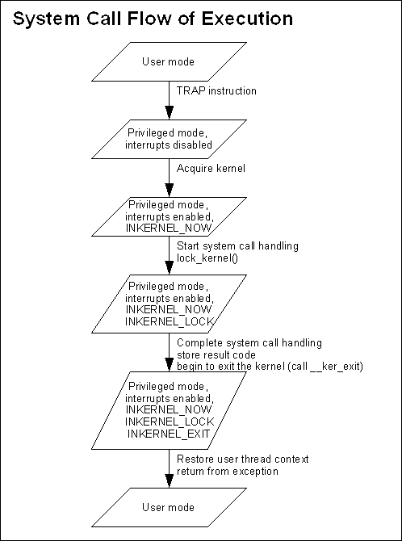
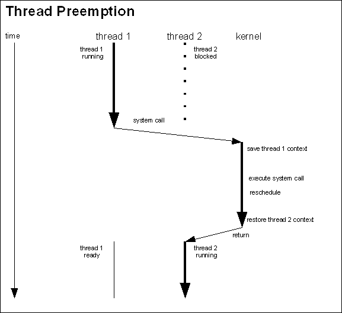
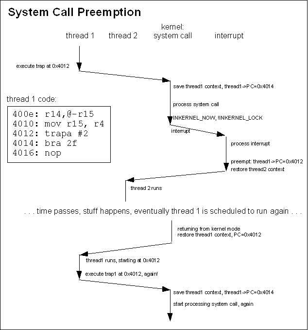
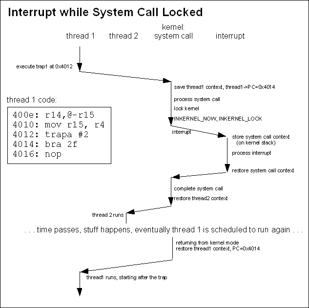

wiki1220: KernelSystemCall
===

Anatomy of a System Call (and other things) 系统调用剖析 (和其他事项)
===

[https://community.qnx.com/sf/wiki/do/viewPage/projects.core_os/wiki/KernelSystemCall]

[TOC]

The micro-kernel never initiates any unsolicited activities. Every thing the kernel does happens as a result of a hardware interrupt, a program exception, or a system call.

A hardware interrupt occurs when a device external to the CPU causes the CPU to interrupt its processing to service the device. A program exception occurs when a program does something that requires special attention, such as accessing memory that doesn't exist. A system call occurs when a program makes an explicit call to one of the system calls implemented in the kernel.

On this page we will discuss how the Neutrino kernel processes these events.

All of the processing of these events is rooted in assembly code, and of course because of that it's not shared between supported CPUs. You can find the code for a particular CPU type in `ker/<CPU>/kernel.S` (for example, `ker/x86/kernel.S`). On some architectures a lower case 's' is used for the the extension rather than upper case. In any case, the overall structure of the contents of the file is the same between all the architectures.

# System State 系统状态:

The kernel state is maintained through a number of variables. The most important of these is the `inkernel` variable. This variable contains flags (`INKERNEL_NOW`, `INKERNEL_LOCK`, `INKERNEL_EXIT `and `INKERNEL_SPECRET`) and an interrupt nesting count. The `inkernel` flags have the following meanings:

内核状态通过多个变量维护。 其中最重要的是 `inkernel`变量。 此变量包含标志 (`INKERNEL_NOW `， `INKERNEL_LOCK `， `INKERNEL_EXIT `和 `INKERNEL_SPECRET`) 和中断嵌套计数。 内核标志具有以下含义

- INKERNEL_NOW

  the kernel has been “acquired” – that is, the kernel is doing some processing.

  内核已“获取”，即内核正在进行一些处理。

- INKERNEL_LOCK

  the kernel has progressed through its processing to the point that the current activity cannot be rolled back – it is not preemptable.

  内核已通过处理进展到无法回滚当前活动的程度 - 它不是可抢占的。

- INKERNEL_EXIT

  originally this flag meant that the current kernel call is complete, so if it gets preempted it isn't necessary to restart the kernel call. It means something slightly different for exception handling. We'll come back to what this one means later, when we talk about preemption.

  最初，此标志表示当前内核调用已完成，因此，如果调用被抢占，则不必重新启动内核调用。 这意味着异常处理略有不同。 当我们谈论抢占的时候，我们将回顾这意味着什么。

- INKERNEL_SPECRET

  Is used to indicate special return processing when leaving the kernel - we won't talk about it in this discussion.
  
  用于指示离开内核时的特殊返回处理 - 我们不会在本次讨论中讨论。

The kernel states and state changes are the same on a uniprocessor (UP) architecture or on a symmetric multiprocessor (SMP) architecture. Ensuring correct mutual exclusion on an SMP architecture is much more difficult, of course.

单处理器 (UP) 架构或对称多处理器 (SMP) 架构上的内核状态和状态更改相同。 当然，要确保 SMP 体系结构上的正确互斥性要困难得多。

# The Basic System Call 基本系统调用:

A system call typically goes through these stages:

系统调用通常经过以下阶段：

1. A user-mode thread makes a call to a system call stub located in libc.
   用户模式线程调用位于 libc 中的系统调用桩（stub）。
2. The system call stub executes a TRAP instruction (or whatever instruction is appropriate for the particular hardware) to cause a trap to privileged mode. This causes interrupts to be disabled.
   系统调用桩（stub）执行TRAP指令 (或适合特定硬件的任何指令) ，以产生trap进入特权模式。 这将导致中断被禁用。
3. The exception handler processes the trap transfers to the generic system call handling code, which stores the thread context, acquires the kernel (i.e. sets the INKERNEL_NOW flag) and enables interrupts.
   异常处理程序处理trap传输到通用系统调用处理代码，并存储线程上下文，获取内核 (即设置 INKEERNEL_NOW 标志) 并开启中断。
4. The system call handler jumps to the function that implements the particular system call that was invoked.
   系统调用处理程序跳至实现所调用的特定系统调用的功能。
5. The system call function starts to do its thing. It does as much as it can before it actually modifies any system state.
   系统调用函数开始发挥作用。 在实际修改任何系统状态之前，它会尽可能多地执行操作。
6. The system call function locks the kernel (i.e. sets the INKERNEL_LOCK flag).
   系统调用函数锁定内核 (即设置 INKERNEL_LOCK 标志)。
7. The system call function does the rest of its work, including modifying the system state, and returns to the generic system call handler.
   系统调用函数执行其其余工作，包括修改系统状态，并返回到通用系统调用处理程序。
8. The generic system call handler restores thread context, clears the `inkernel` flags and returns to user mode (it disables interrupts while performing these steps).
   通用系统调用处理程序恢复线程上下文，清除`inkernel`标志并返回到用户模式 (执行这些步骤时禁用中断)。

Notice that during the processing of the system call interrupts are disabled for very small windows. The actual work of the system call is performed with interrupts enabled. It is one of the fundamental requirements of the Neutrino kernel that interrupt latency be minimized. How can we minimize interrupt latency if interrupts are disabled for large parts of the system call processing? This of course begs the question: so what happens if an interrupt occurs while a system call is being processed? The answer could be “preemption”.

## Thread Preemption 线程抢占:

One point to be careful of: during kernel processing (processing of a system call, or exception, or interrupt), the kernel might change the active thread. That is, the thread that is active when the kernel is entered might not be the same thread that is active when the kernel is exited. When the kernel is entered, the context of the currently active thread is stored in that thread's control block. When the kernel is exited, the context of the currently active thread is restored from it's control block. But while the kernel is active, the currently active thread might change.

This can happen if the action of the system call, exception or interrupt causes a rescheduling event or causes the current thread to block.

The following diagram shows the processing of a system call that causes a higher priority thread that was blocked to become ready.

# Basic Exceptions 基本异常:

There are many different types of exceptions, and some are handled in special ways that don't involve acquiring the kernel. However, in general exception processing, it is necessary to acquire the kernel (for example, to generate a SEGFAULT when a thread makes a bad memory access).

The possible states for exception handling are the same between system calls and general exceptions. Much of the code base (well, much of the kernel-exit code, at least) for general exception processing is shared with system call handling. As such, we won't describe the flow of events in detail here.

Note that in exception processing the kernel is normally locked immediately (i.e. INKERNEL_LOCK is set at the same time INKERNEL_NOW is set). This means that exception processing is normally not preemptable. In certain cases the exception-handling code might allow itself to be preempted, however.

This is where the INKERNEL_EXIT flag gets used... When a system call is preempted, the program counter in the saved context must be tweaked to ensure that the system call is re-executed. When most exceptions occur (a page fault, for example) the saved context already points to the instruction that caused the exception. When one of these exceptions is preempted, we don't want the saved context to have it's program counter tweaked – it's already in a state that will result in the instruction that caused the exception to be rerun. So, if the exception processing unlocks the kernel, it can also set the INKERNEL_EXIT flag so that if it gets preempted the saved context won't be tweaked.

All of that can be academic, though. On the SH-4 platform, for example, none of the exception handlers use this mechanism. All of them set INKERNEL_LOCK immediately and don't relinquish the kernel lock until the exception processing is complete.

# Basic Interrupts 基本中断:

In this section, we look at normal interrupt handling. We look at the case where a user-mode thread is running when the interrupt occurs. In later sections we look at the (much more complex!) case where an interrupt occurs during the processing of an exception or system call.

The actual interrupt vector code is... complex. Maybe even 'ugly'. Perhaps 'evil' wouldn't be too strong of a word... When an interrupt occurs, the code that is run is generated at the time of system initialization. It is generated by sticking together bits and pieces that are picked up from different places. Fortunately, for the most part, we don't need to look at the whole picture. We just need to look at the pieces involved in the kernel state. Check out the cpu_interrupt_init() routine in ker/x86/init_cpu.c (for x86) or ker/<CPU>/interrupt.c (for other architectures) if you want to see how interrupt vectors are generated. You might notice that the routines are very similar between the architectures. They really should be refactored so that a lot more of the code is cpu independent. Something for a rainy day....

For this discussion, we need to know that the first piece in an interrupt vector is the piece of code taken from kernel.S at the intr_entry_start label. The last piece of the interrupt vector is taken from kernel.S at the intr_done label.

The interrupt vector consists of the following steps:

1. intr_entry_start:
   - determine that a user-mode thread was running
   - save the thread context (i.e. registers) in the thread control block
   - increments the interrupt nesting count in the inkernel variable
2. process the interrupt and invoke any interrupt handlers
3. intr_done
   - decrement the interrupt nesting count
   - ker_exit:
     - set INKERNEL_NOW, INKERNEL_LOCK and INKERNEL_EXIT
     - restore thread context and return to user mode

Pretty straightforward; I don't think we need a diagram. But note that the interrupt vector doesn't acquire the kernel (set INKERNEL_NOW) until the end – interrupt processing isn't exactly kernel mode until the end where any effects of the interrupt processing are taken into account.

# Mixing Things Up – Concurrent Events 混在一起 - 事件并发

This is where things really start to get complex. During the processing of a system call or an exception, an interrupt can happen. During processing of an interrupt, another interrupt can happen. An exception can happen at any time. When we look at how these events can be handled together and yet allow us to maintain consistency, things get messy (particularly on exiting the kernel). We'll mix SMP issues into it at the end – and things get worse.

## Exceptions during Other Events 其他事件期间的异常:

There are many different possible exceptions, and each is (typically, mostly) implemented differently. However, there are some common properties.

An exception will typically fall into one of two categories: either the exception handler can resolve the cause of the exception without acquiring the kernel (e.g. a TLB-miss exception, where the handler just loads a new TLB into the MMU), or it cannot and a fault results (e.g. a division by zero exception, where the exception handler wants to deliver a signal to the faulty thread, but there is no thread object since the fault was caused by the kernel or an interrupt handler).

If the exception handler doesn't need to acquire the kernel, it can go ahead and resolve the condition that caused the exception. If the exception handler can't resolve the condition, it causes a kernel crash.

Causing a kernel crash is not as much of an over-reaction as you might think. If it caused by the interrupt handling code in the kernel, then it is indicative of a bug in that code. Similarly, authors of interrupt handlers must be very careful – they must guarantee that an exception that will cause a fault is not possible, otherwise they can crash the kernel.

An exception that happens while a system call or another exception is being processed might also cause a kernel crash. If an exception that results in a fault happens while the kernel is locked, the kernel will crash. Again, the kernel code must be written in such a way that guarantees that faults are not possible.

If an exception that causes a fault occurs during the processing of a system call while the kernel is not locked, we set the system call error and pass through ker_exit. This has the effect of terminating the system call, but not preempting it. Instead, the system call returns an error indication and sets errno.

## Interrupts and System Call Preemption 中断和系统调用抢占:

We'll start by looking at what happens when an interrupt occurs during the processing of a system call. In this case, processing of the interrupt proceeds much like it would if a user-mode thread had been running, excepting that the current register set is saved on the kernel stack instead of on a thread control block.

Strong differences show up when the interrupt completes. The Neutrino kernel might return to processing the system call, or it might choose to preempt the system call. If the system call had the kernel locked (INKERNEL_LOCK was set), then the interrupt handler will simply restore the kernel context off the stack and continue with the system call. However, if the system call did not have the kernel locked the system call may will be preempted: it will be preempted if the sigevent being delivered by the interrupt will cause a higher priority thread to become ready.

We need to be really careful here, because when we're talking about system call preemption, we mean something different than normal thread preemption. However, 'preemption' is the term used in the source code (kernel.S) so it's best if we stick with the term but be careful in our usage.

Remember that while threads might cause kernel activity, while the kernel is running it's not really fair to say that the thread is running. While a system call is executing the current thread might be preempted (that is, another thread might be selected to run). But if the system call itself is preempted, that's a different thing and that's what we're going to talk about in this section.

For the remainder of this section, when I use the term 'preempted' that's what I'm talking about. But keep in mind that in general, “preemption” could mean thread preemption or it could mean system call preemption.

A system call can only be preempted when a hardware interrupt occurs.

If the current thread was in the middle of a system call when an interrupt occurs, we need to figure out what to do with the system call context. The Neutrino kernel uses a single kernel stack (per CPU) and the stack of the user thread that invoked the system call is in a different address space (not readily available), so there is no place to store the context for a partially-completed system call.

The model that Neutrino uses is to allow the system call to be canceled and restarted. When it is necessary to preempt the execution of a system call, the processing done to date on that system call is discarded, and when the active thread is allowed to run again the system call will be restarted.

We have to be careful if the system call has started to change things: any changes on its own stack can be ignored since we'll discard the stack if we preempt the system call, but if the system call has started to change the kernel data structures, a preemption might leave these data structures in an inconsistent state. So a system call must do everything it can before it starts to change the kernel data structures, then it must invoke lock_kernel() (which sets the INKERNEL_LOCK flag), then it must complete its work as fast as possible. While a system call has the INKERNEL_LOCK flag set, it cannot be preempted – the system call will be allowed to run to completion. This is a small lie - when the kernel is locked, it's no longer asynchronously preemptable, but the kernel code can check for a preemption request manually and abort the call then as long as it takes care to make sure the data structures are in a sane state for when the call restarts - look for KER_PREEMPT() macros in the source for examples of this.

Note that INKERNEL_LOCK does not prevent an interrupt from being serviced. The interrupt will be serviced and any interrupt handlers will be run, but when that is all complete the system call will pick up execution where it left off – regardless of whether or not the interrupt processing resulted in higher priority threads being ready, the current thread will be allowed to complete the execution of the system call.

Some system calls lock the kernel, make some changes to the system state, and then unlock the kernel again. This is safe as long as the kernel data structures are in a consistent state when the system call unlocks the kernel. Also, it must be safe to repeat the portion of the system call completed so far, since if the system call gets preempted at this point it will be restarted and the portion of the work completed to date will be repeated.

The system call implementations try to minimize the time that they are locked. This means that they are more likely to be preempted and have to do some work over again. But it also means that higher priority threads aren't blocked from running; minimizing thread latency is another key goal of Neutrino.

So how do we restart a system call if it is preempted? That's easy. The thread's context was saved (in the thread control block) when the thread started the system call. It's full register state is there. The only issue is that the program counter points to the instruction after the TRAP instruction. So, if we need to preempt a system call, we tweak the saved context so that the saved program counter points to the TRAP instruction. When the thread runs again, it will pick up by starting the TRAP instruction again.

The following diagrams show two cases: an interrupt causing a system call to be preempted in the first diagram, and an interrupt occuring while a system call is locked in the second diagram.

The INKERNEL_EXIT flag is used to indicate whether or not the system call has completed. If a system call is preempted while INKERNEL_EXIT is set, the system call has completed so we don't tweak the register context. Note that for most of normal system call processing, we never set INKERNEL_EXIT unless INKERNEL_LOCK is also set, so the system call can't be preempted regardless. There are portions of the special return processing (INKERNEL_SPECRET is set) where the INKERNEL_LOCK will get turned off though.

## Nested interrupts 中断嵌套

A nested interrupt (an interrupt that occurs during the processing of another interrupt) is handled in the same manner as an interrupt that occurs while a system call has the kernel locked. The current register context is stored on the kernel stack, the interrupt is processed, the previous interrupt's context is pulled of the stack and the previous interrupt is allowed to continue.

## SMP Issues SMP 问题:

With multiple CPUs, all of these problems are magnified. In addition to multiple events (system calls, exceptions, interrupts) all happening on one CPU, they can all be happening simultaneously on different CPUs.

The key issue surrounding SMP architectures and kernel processing is that only one CPU is allowed to acquire the kernel at one time (small lie, see the [SMP section](https://community.qnx.com/sf/wiki/do/viewPage/projects.core_os/wiki/SymmetricMultiProcessing) for details). This means, for example, that if two threads on different CPUs are simultaneously trying to make system calls, one will block (busy-wait) until the other completes. Similarly, if a thread on one CPU is making a system call when a thread on another CPU causes an exception, the exception processing will wait for the system call to complete before the exception can be processed.

But what about interrupts? We can't block the processing of interrupts while we wait for something else to complete. Recall that interrupt processing doesn't actually acquire the kernel until the interrupt processing completes. Aside from requiring extra concurrency protection around updating the state variables, most of the extra complexity in interrupt processing is in the intr_done routine.

To deal with SMP issues, we have a few differences in our state variables. The interrupt nesting counter in inkernel keeps track of the global nesting count, across all CPU's, so it can't be used to determine if a particular processor is handling an interrupt. Therefore a CPU specific mechanism is used for this. For example, on MIPS a field on the cpupage is used. Also, when we are in the kernel (INKERNEL_NOW is set), there is a variable that indicates which CPU acquired the kernel.

The SMP interrupt return code in intr_done must handle the following cases:

- Returning from an interrupt that occurred while processing a different interrupt. Regardless of what is happening on the other processors, this case is treated the same as on a UP architecture – simply return to processing the previous interrupt.
- Returning from an interrupt on one CPU that occurred while the same CPU was in the kernel but didn't have the kernel locked. This is handled in the same way as a UP architecture would handle it – the system call being processed is preempted.
- Returning from an interrupt on one CPU that occurred while the same CPU was in the kernel and had the kernel locked. If we can't preempt the system call because it has the kernel locked we send an IPI (Inter-Processor Interrupt) to a different CPU to do some of the interrupt cleanup. Note that if we didn't send the IPI, we would do the cleanup when the current system call completed (as is done on a UP architecture) but by sending the IPI and having the cleanup done on a different CPU we reduce the thread latency of any threads waiting to handle events from the interrupt that has just completed.
- Returning from an interrupt on one CPU while a different CPU is in the kernel. Since another CPU is in the kernel, that implies that the CPU executing the interrupt must have been outside the kernel when the interrupt occurred. In this case, we still need to be careful about an ongoing system call – we might need to preempt it even though it is on a different CPU. In this case, we send an IPI to the CPU that is in the kernel, then return to user-mode without doing the normal end-of-interrupt cleanup. The IPI causes the other CPU to take an interrupt, preempt or continue the system call as appropriate, and then do the normal end-of-interrupt cleanup – we hand the end-of-interrupt cleanup off from the CPU that took the “real” interrupt to the one that was running in the kernel.