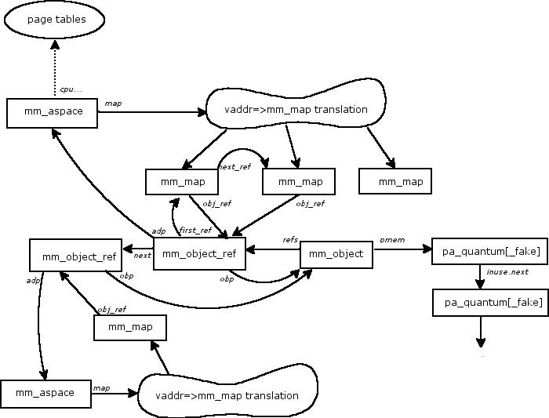

wiki1321: Vmm_data_structures
===

https://community.qnx.com/sf/wiki/do/viewPage/projects.core_os/wiki/Vmm_data_structures

[TOC]



# base memory object

The object structure is shared between both the `pathmgr` and `memmgr` components of `procnto`. They mostly keep to themselves, but there were a couple of places where interface breaking goes on - these are marked with comments in the source.

```c
struct mm_object {
	struct object_header        hdr;

	struct pathmgr_stuff {
		 time_t                  mtime;
		 mode_t                  mode;
		 uid_t                   uid;
		 gid_t                   gid;
	}       pm;
			  
	struct memmgr_stuff {
		struct proc_mux_lock    *mux;
		struct pa_quantum       *pmem;
		struct pa_quantum       **pmem_cache;
		struct mm_object_ref    *refs;
		struct pa_restrict      *restrict;
		off64_t                 size;
		unsigned                flags;
	}       mm;
};
```

The *`pm`* fields are for use by path manager.

The *`mm`* fields are for use by memory manager.

- *`mux`*

  For locking/unlocking the memory object via the *`proc_mux_[un]lock`* functions.

- *`pmem`*

  The head of the list of physical memory for the object.

- *`pmem_cache`*

  Used for optimization purposes while walking the `pmem` list

- *`refs`*

  The head of the list of address spaces that are currently referencing this object.

- *`restrict`*

  When allocating physical memory for this object, the memory has to obey this restriction list.

- *`size`*

  The size in bytes of the object.

- *`flags`*

  Various flags for the object - some flags are common across all the types of memory objects, some flags are unique to each different type.

# OBJECT_MEM_ANON

```c
struct mm_object_anon {
	struct mm_object    mem;
};
```

# OBJECT_MEM_SHARED

```c
struct mm_object_shared {
	struct mm_object    mem;
	volatile unsigned   name_refs;
	unsigned            special;
	intptr_t            vaddr;
};
```

- *`name_refs`*

  This should really be a `pathmgr` thing, but then all the objects would have the space allocated. It's the number of open file descriptors for the object.

- *`special`*

  This holds the value of the *`special`* parameter of the *`shm_ctl_special`* function.

- *`vaddr`*

  For shared objects using global addresses (e.g. ARM above 32M), this field holds the base address of the object.
  

# OBJECT_MEM_FD

```c
struct mm_object_fd {
	struct mm_object    mem;
	int                 fd;
	time_t              ftime;
	ino_t               ino;
	dev_t               dev;
	char                *name;
	unsigned            pending_dones;
};
```

- *`fd`*

  The file descriptor obtained from `_IO_MMAP` that `procnto` uses to read/write to the backing file for the object.

- *`ftime`, `ino`, `dev`*

  These values are obtained by a *`stat`* of the file and are used by the `memmgr` to determine when the underlying file has been modified.

- *`name`*

  The debugging name of the object.

- *`pending_dones`*

  used to prevent a race condition when freeing the object.
  

# OBJECT_MEM_TYPED

```c
struct mm_object_typed {
	struct mm_object_shared shmem;
	char                    *name;
};
```

## mm_aspace (ADDRESS)

```c
struct mm_aspace {
	struct mm_map_head          map;
	struct  {
		uintptr_t       vmem;
		uintptr_t       data;
		uintptr_t       stack;
		uintptr_t       memlock;
		uintptr_t       rss;
	}                           rlimit;
	OBJECT                      *anon;
	struct _memmgr_rwlock       rwlock;
	unsigned                    fault_owner;
	unsigned                    flags;
	uintptr_t                   tmap_base;
	size_t                      tmap_size;
	struct cpu_mm_aspace        cpu;
};
```

- *`map`*

  Head of the vaddr to *`struct mm_map`* conversion structure.

- *`rlimit`*

  Holds the current usage various rlimit pieces.

- *`anon`*

  Pointer to the *`OBJECT_MEM_ANON`* object for the address space.

- *`rwlock`*

  Used for reader/writer locks on the address space.

- *`fault_owner`*

  In some cases we could have an address space locked and be performing some request which causes a page fault to occur. Normal fault handling will attempt to lock the address space again. This field is used by the fault handling code to recognize when the faulting thread is a `memmgr` one that already had the `aspace` locked, so the fault code doesn't have to do so again (avoiding a deadlock).

- *`flags`*

  Various `aspace` related flags.

- *`tmap_base`, `tmap_size`*

  The `memmgr` sometimes has to read/write data into physical memory that it currently does not have a mapped virtual address. These fields give the base and size of the last temporary mapping region that we used. If no mmap's have been done in the meantime, we can reuse that region, saving us from having to look for a new one.

- *`cpu`*

  All the CPU specific address space fields.

## mm_map

```c
struct mm_map {
	struct mm_map           *next;
	struct mm_object_ref    *obj_ref;
	off64_t                 offset;
	struct {
		struct mm_map           *next;
		struct mm_map           **owner;
	}						ref;
	uintptr_t               start;
	uintptr_t               end;
	int                     reloc;
	unsigned                mmap_flags;
	unsigned                extra_flags;
	unsigned short          last_page_bss;
	uint8_t                 spare;
	volatile uint8_t        inuse;
};
```

- *`next`*

  Pointer to the next squentially higher mapping in this aspace.

- *`obj_ref`*

  Pointer to the *`struct mm_object_ref`* for this mapping.

- *`offset`*

  The offset from the start of the object for this mapping.

- *`ref.next`*

  The next mapping in this address space that references the same object as this one.

- *`ref.owner`*

  A pointer to a pointer of previous mapping in this address space that references the same object as this one.

- *`start`*

  The starting virtual address of this mapping.

- *`end`*

  The last valid virtual address of this mapping.

- *`mmap_flags`*

  The combination of the mmap *`flags`* and *`prot`* parameters.

- *`reloc`*

  The debugging relocation.

- *`extra_flags`*

  Some other additional flags for this mapping.

- *`last_page_bss`*

  With a `MAP_ELF` mapping, the `memmgr` code determines if the final page of a mapping would go beyond the end of the filesz field of the ELF segment. In that case, the *`last_page_bss`* field indicates how many bytes at the end of the page should be zeros.

- *`inuse`*

  Whether there are still people pointing at this structure, even though the aspace has been unlocked.

## mm_object_ref

```c
struct mm_object_ref {
	struct mm_object_ref    *next;
	struct mm_aspace        *adp;
	OBJECT                  *obp;
	struct mm_map           *first_ref;
	int                     fd;
};
```

- *`next`*

  Pointer to the next *struct mm_object_ref* for the object.

- *`adp`*

  Pointer to the address space for this reference.

- *`obp`*

  Pointer to the actual object for this reference.

- *`first_ref`*

  Pointer to the head of the linked list of *`struct mm_map`*s that reference the given object in the given address space.

- *`fd`*

  The user file descriptor that was passed into *`mmap`* for the mapping.

## pa_quantum

```c
struct pa_free_link {
	struct pa_quantum   *next; // must be first entry
	struct pa_quantum   **owner;
};
 
struct pa_inuse_link {
	struct pa_quantum   *next; // must be first entry
	_Uint32t            qpos;
}; 
 
struct pa_quantum {
	union {
		struct pa_inuse_link    inuse;
		struct pa_free_link     flink;
	}           u;
	_Int32t     run;  
	_Uint16t    blk;   
	_Uint16t    flags;
};
```

- *`u.flink`*

  Doubly linked list used when the quantum is not in use.

- *`u.inuse`*

  Singly linked list used when quantum is in use.

- *`run`*

  There's one `pa_quantum` for each page of system ram in the system. These are collected into contiguous runs - either allocated or unallocated. For the first quantum in a run, the *`run`* field indicates the number of quantums in the run. The last quantum has the same value in it's *`run`* field, but negated. The quantums in the middle have zero for the field.

- *`blk`*

  This field holds the block number for the quantum. A block is a contiguous sequence of system ram.

- *`flags`*

  Various flags.

## pa_quantum_fake

```c
struct pa_quantum_fake {
	struct pa_quantum   q;
	paddr_t             paddr;
};
```

Since the physical memory list of an object must be made up of quantums, and we only allocate enough `pa_quantum`'s to cover the system ram for a box, something special has to be done when the user requests a direct physical mapping. In those cases, we create a `pa_quantum_fake`. These differ from a normal `pa_quantum` in that they have a *`paddr`* field attached to them to give the physical address (normal `pa_quantum`'s obtain the physical address from information in the block head structure) and the fact that no matter how many pages the mapping is for, only one `pa_quantum_fake` structure is allocated, as opposed to the array of `pa_quantum`'s that would be used to cover the same amount of physical memory. Code can tell the difference between the two by the fact that `pa_quantum_fake`'s *`blk`* field is set to `PAQ_BLK_FAKE`.

